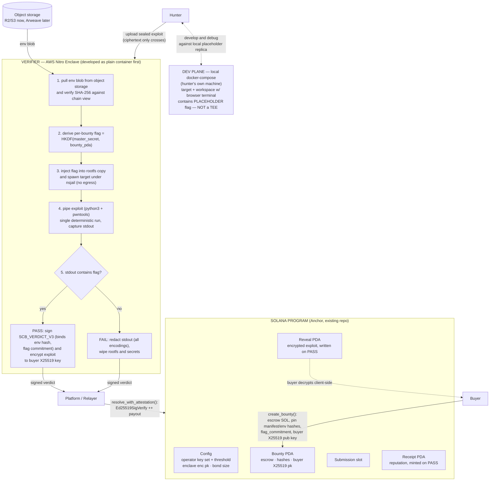

# SealedCodeBounty — Build Plan (R3, Handoff Document)

> **Purpose of this document:** a precise, self-contained specification of what to build, in what order, with which tools. It is written so that another engineer or AI agent can execute it without re-deriving any decisions. All open questions were settled in design reviews on 2026-08-24; locked decisions are listed in §1 and must not be re-litigated.

---

## Revision log

**R3 — post third external review (2026-08-24). Adopted:**
**verdict binds `env_blob_sha256`** — message bumped to `SCB_VERDICT_V3`, on-chain assert closes the environment-substitution payout hole where a colluding relayer could get a PASS minted against a fake weak target (§4.1);
**stable enclave identity keys** — signing + encryption keys are now derived from the KMS-delivered master secret via HKDF at boot instead of freshly generated per reboot, eliminating stale-key orphaning of in-flight submissions after redeploys and the re-pinning ceremony (D14, §4.4);
**storage abuse controls** — pre-registration blob uploads now face per-wallet/IP rate limits, TTL deletion for blobs never registered on-chain, and a global storage cap (§4.3);
**determinism parity** — the dev-plane compose file MUST apply the identical determinism block as the verifier, so "prove reliability locally" (D13) stays true (§4.5);
**redaction completeness** — FAIL-log scrubbing extended to base58 (the flag's own encoding) plus double-encodings (D11);
**trust-model documentation** — new §11 states plainly what v1 trusts: the grader image, published as open source with a reproducible build recipe, PCR0 hash pinned on-chain, and authority operations behind multisig + timelock. Trust-minimized, not zero; federation and ZK remain roadmap (§11).

**R2 — post second external review (2026-08-24).** Deterministic single-run verification (D13); hardened on-chain signature introspection binding message bytes + operator keys (not mere presence of an Ed25519 instruction); `flag_commitment` bound into the verdict (`SCB_VERDICT_V2`) closing committed-but-unchecked; KMS-from-enclave via vsock corrected (enclave has no NIC — `kmstool_enclave_cli` path); binary manifest target kind added alongside `tcp_service`; why-Nitro-over-Inco rationale recorded (§2); concurrency stays single-slot (honest note on D5).

**R1 — post external review (2026-08-24).** Solver-signed submission intent verified by the enclave; client-side encrypt-to-enclave uploads (proxy/storage never see plaintext — supersedes the earlier "trust the parent proxy" allowance); master secret delivered via KMS policy conditioned on attestation doc; permissionless `force_unlock_submission` + post-deadline submit guard killing the relayer-censorship funds deadlock; refundable submission bond replaces free submissions; dev plane reduced to local compose files; CTF-challenge-first scope statement; full README rewrite moved into phase 0.

---

## 0. Architecture at a glance



**Two-plane rule (memorize this):** confidentiality only matters at *verification* time. Hunters develop against flag-stripped replicas in a normal Docker sandbox on their own machines (dev plane). The real flag and the plaintext exploit only ever coexist inside the enclave (verification plane). Nothing in the dev plane needs a TEE.

---

## 1. Locked design decisions (do not revisit)

| # | Decision |
|---|---|
| D1 | **Product**: sealed exploit bounties. Buyer uploads a vulnerable environment; hunters upload exploits; success = exploit output contains a hidden flag; first verified PASS takes the whole pot; on PASS the buyer receives the exploit, on FAIL nobody ever sees it. |
| D2 | **Scope v1 = userspace targets only** (network services, binaries, parsers — pwn.college-style), positioned as **self-contained CTF-style challenges** until a buyer ownership mechanism exists. Kernel-exploit tier (QEMU/KVM targets) is roadmap phase 9. |
| D3 | **Verification = flag-only.** No buyer-supplied checker code exists anywhere in the system. Platform-generated random flag injected inside the enclave. |
| D4 | **Payout trigger** = enclave's ed25519-signed verdict `{bounty_pda, env_blob_sha256, exploit_sha256, solver_pubkey, flag_commitment, outcome}` (`SCB_VERDICT_V3`), verified on-chain against keys pinned in `Config`. Binding `env_blob_sha256` means a verdict can only pay out if verification ran against **exactly the environment the buyer pinned** — no substitute-environment attacks. No private-key-as-prize. No ZK anywhere in v1. |
| D5 | **First verified PASS wins**, ordered by Solana slot. v1 note: because v1 serializes to a single in-flight submission slot (§4.1), this is in practice "first to claim the slot and pass"; true concurrent first-PASS-wins (per-solver Submission PDAs) is a roadmap upgrade (phase 9). |
| D6 | **TEE = AWS Nitro Enclave** for v1 (container rootfs + nsjail inside the enclave; no nested virt needed). The on-chain interface is signature-only, so migrating later to Intel TDX / SEV-SNP confidential VMs changes pinned values, not program logic. Why Nitro over Inco Lightning: Inco provides encrypted-data *operations* (compute over ciphertext), not arbitrary in-enclave code execution. Exploit verification needs a full userspace Linux workload (unpack rootfs, inject flag, nsjail-sandboxed target + attacker binaries) — a Nitro Enclave runs that directly; Inco cannot. |
| D7 | **Trust root v1**: platform authority pins `(pcr0_hash, enclave_ed25519_pubkey)` pairs in `Config` (key SET with threshold k-of-n from day one). v1 trust posture is **trust-minimized, not zero**: the grader logic ships as public source with a reproducible build recipe (anyone can rebuild the EIF and compare PCR0 against the pinned value), and authority operations (`set_operators`) sit behind multisig + timelock so an enclave swap is always visible on-chain with warning time. See §11 for the full trust ladder. Honest limitation documented: v1 users ultimately trust that the published grader source is honest. |
| D8 | **Storage**: Cloudflare R2 (or S3) bucket for env tarballs and oversized blobs in dev; migrate to Arweave for production. Only SHA-256 hashes + a manifest go on-chain. Exploit ciphertexts stored client-side-sealed — storage never sees plaintext (see D9/handshake). |
| D9 | **Reveal mechanism**: on PASS the enclave encrypts the exploit with the buyer's X25519 public key (registered in `create_bounty`) using a libsodium sealed box and writes the ciphertext into an on-chain `Reveal` PDA inside the payout transaction. Buyer decrypts client-side. Blobs > ~10 KB fall back to encrypted-object-on-R2 + hash on-chain. |
| D10 | **No revenue fees in v1**, but every submission posts a small refundable bond (lamports held in the Bounty PDA, returned automatically inside `resolve_with_attestation` regardless of outcome, and by `force_unlock_submission`). Spam costs capital-in-flight instead of being free; revenue fees and bond slashing stay deferred. Old `SUBMISSION_FEE_LAMPORTS` semantics deleted. |
| D11 | **Failure feedback**: hunter receives their exploit's stdout/stderr with every occurrence of the flag string redacted — including its **hex, base64, AND base58 encodings, plus double-encodings (e.g. hex-of-base64)** — since the flag itself is base58 text. → `[REDACTED]`. |
| D12 | **Solana's role beyond escrow** (build now, market always): verdict receipts as portable on-chain reputation; config designed for operator sets; agent-friendly API story. Deferred: staked operator slashing, escrow yield, disclosure-clock auto-publish, sealed-bid ranking. |
| D13 | **Deterministic verification (v1).** The enclave runs the exploit exactly once; PASS requires that single run's output to contain the flag. Exploits MUST therefore be deterministic — defeat ASLR within the exploit, avoid timing races. The manifest MAY request ASLR-off / fixed-seed in the target; **whatever determinism settings the verifier applies, the dev-plane compose file MUST apply identically** (parity rule, §4.5), so local proof-of-reliability transfers to verification. Best-of-N re-runs are roadmap phase 9. |
| D14 | **Stable enclave identity keys.** The enclave does NOT generate fresh keypairs per boot. At startup it fetches master secret `M` from KMS (attestation-gated, §4.4) and derives both identity keys deterministically: `verdict_key = ed25519.keypair(HKDF(M, info="scb-verdict-key-v1"))`, `enc_key = X25519(HKDF(M, info="scb-enc-key-v1"))`. Consequences: redeploys/reboots never orphan in-flight submissions sealed to `Config.enclave_enc_pk`; the operator pins keys once, not per deploy; blast radius of `M` already covers flags, so key derivation adds no new exposure. |

---

## 2. Current repository state and required cleanup

Repo: `/home/konstantine/Documents/work/sealed-code-bounty` (Anchor workspace, tests currently target devnet via ts-mocha).

Existing assets to KEEP:
- `programs/sealed-code-bounty/` — working escrow logic: `create_bounty.rs`, `submit_solution.rs`, `resolve_submission.rs` (manual, insecure-by-design — will be replaced), `cancel_expired_bounty.rs`; `state.rs`, `constants.rs`, `error.rs`, `events.rs`.
- `frontend/` — React + Vite + wallet-adapter skeleton (`useProgram.ts`, `pda.ts`, three forms).
- `tests/sealed-code-bounty.ts` — four integration tests proving money movement.

Cleanup steps (phase 0):
1. `git checkout -b v2` — do all v2 work on this branch.
2. Delete `programs/sealed-code-bounty-poc/` (the Inco Lightning proof-of-concept). Inco is fully out of the architecture (D6/D4). Keep it recoverable via git history.
3. Rewrite `README.md` for the pivoted architecture (Nitro narrative, honest v1 trust-root section per §11, updated mermaid) and tag `EXPLAIN.md` as pre-pivot history. No reader should meet two architectures in one repo.
4. Switch the test suite default from devnet to a local validator (`anchor test` runs localnet by default; keep one optional devnet smoke test behind an env flag).

---

## 3. Component inventory

| Component | Tech | New/existing | Notes |
|---|---|---|---|
| Solana program v2 | Anchor (Rust) | evolve existing | §4.1 |
| Packager CLI | TypeScript (Node) or Rust | new | §4.2 |
| Verifier runner | Rust (axum + tokio) | new, core | §4.3 |
| TEE envelope | AWS Nitro Enclave (nitro-cli, EIF, NSM) | wrapper around runner | §4.4 |
| Relayer | TypeScript (Node) | new, tiny | §4.6 |
| Indexer + receipts API | TypeScript (Node) + SQLite/Postgres | new, small | §4.7 |
| Frontend v2 | existing React/Vite + wallet-adapter + libsodium | evolve | §4.8 |
| Dev plane sandbox | local Docker Compose (packager-emitted) | new, thin | §4.5 |

---

## 4. Component specifications

### 4.1 Solana program v2 (`programs/sealed-code-bounty/src/`)

Keep the module layout (`instructions/`, `state.rs`, `errors.rs`, `events.rs`, `constants.rs`). Evolve in place.

#### Accounts

**`Config`** (PDA seed `["config"]`, singleton):
- `platform_authority: Pubkey` — v1: a **multisig** (Squads or custom), never a plain wallet
- `operators: Vec<Pubkey>` — enclave verdict-signing keys (start with n=1)
- `threshold: u8` — required matching signatures (start with 1)
- `enclave_enc_pk: [u8; 32]` — enclave's X25519 encryption key (hunters seal exploit uploads to it client-side). **Stable across redeploys** thanks to D14 derivation.
- `submission_bond_lamports: u64` — refundable anti-spam bond per submission (D10)
- `bump`

Created by `initialize_config(platform_authority)`. Updated by `set_operators(operators, threshold)` — authority-only **via multisig; wrap deployment procedure so key swaps are deliberate, visible events** (timelock discipline documented in §8; program-level timelock is roadmap).

**`Bounty` v2** (PDA seed `["bounty", buyer, bounty_id]`):
- `buyer: Pubkey`, `bounty_id: u64`
- `status: BountyStatus` — enum `{Open, AwaitingResolution, Resolved, Cancelled}`
- `prize_lamports: u64`, `deadline: i64`
- `manifest_sha256: [u8; 32]`
- `env_blob_sha256: [u8; 32]` — hash of the environment tarball; **bound into every verdict (SCB_VERDICT_V3)**
- `flag_commitment: [u8; 32]` — `sha256(flag)` produced by the enclave sealing step; bound into every verdict
- `buyer_enc_pk: [u8; 32]` — buyer's X25519 public key
- `current_submission: Option<SubmissionRef>` — `{solver: Pubkey, exploit_sha256: [u8;32], blob_url: String≤200, bond_lamports: u64, submitted_at: i64}` (single-slot serialization; retry allowed only after FAIL/unlock resolution)
- `winner: Option<Pubkey>`
Escrow: prize transferred into the PDA at creation; rent swept on close.

**`Receipt`** (PDA seed `["receipt", bounty, winner]`, created only on PASS):
- `bounty: Pubkey`, `solver: Pubkey`, `exploit_sha256: [u8; 32]`, `first_blood: bool`, `timestamp: i64`

**`Reveal`** (PDA seed `["reveal", bounty]`, created only on PASS):
- `ciphertext: Vec<u8>` ≤ 10_240 bytes (libsodium sealed box over the exploit script)
- If the sealed box exceeds the cap, store `ciphertext_url: String≤200` + `ciphertext_sha256` instead.

#### Instructions

| Instruction | Who | Signature/args | Validation highlights |
|---|---|---|---|
| `initialize_config` | deployer | `(platform_authority)` | once |
| `set_operators` | authority (multisig) | `(operators: Vec<Pubkey>, threshold: u8, enclave_enc_pk)` | `threshold ≥ 1 && threshold ≤ len` |
| `create_bounty` | buyer | `(bounty_id, prize, deadline, manifest_sha256, env_blob_sha256, flag_commitment, buyer_enc_pk)` | nonzero prize; future deadline; escrow transfer into PDA |
| `submit_exploit` | hunter | `(blob_url ≤200 chars, exploit_sha256)` | status Open; `current_submission.is_none()`; `Clock::get() < deadline`; transfers bond from hunter into PDA; sets AwaitingResolution |
| `resolve_with_attestation` | relayer (permissionless) | `(outcome: bool, sig_count, signatures: Vec<[u8;64]>)` + accounts incl. Ed25519 native program and Instructions sysvar | see verification pattern below; PASS ⇒ pay winner + create Receipt + create Reveal + status Resolved; FAIL ⇒ wipe submission, status Open; bond refunded either way |
| `cancel_expired_bounty` | buyer | unchanged | expired AND no pending submission |
| `force_unlock_submission` | anyone (permissionless) | accounts only | while `AwaitingResolution` and `submitted_at + FORCE_UNLOCK_DELAY_S < Clock::get()` (3600 s); refunds bond, wipes submission, status Open. A hostile/silent relayer can delay, never lock. |

**Verdict message (canonical bytes, signed by enclave) — `SCB_VERDICT_V3`:**

```
msg = b"SCB_VERDICT_V3"      (14 B domain tag)
    || bounty_pda            (32 B)
    || env_blob_sha256       (32 B)   <-- NEW in R3: which environment was verified
    || exploit_sha256        (32 B)
    || solver_pubkey         (32 B)
    || flag_commitment       (32 B)
    || outcome               ( 1 B, 0x00=FAIL 0x01=PASS)
```

161 bound bytes, 175 B on the wire. Binding `env_blob_sha256` closes the last fraudulent-payout path: without it, a colluding relayer could feed the enclave a fake weak environment (with a consistent fake chain-view), harvest a PASS against it, and the on-chain program could not tell — because the flag derives from `bounty_pda` alone and nothing recorded *which* environment produced the verdict. With the binding, any verdict minted against a substitute environment fails the on-chain equality check and can never pay.

**Solver authentication:** the enclave never learns the solver from the relayer. Before executing anything it verifies `solver_ed25519_sign(b"SCB_SUBMIT_V1" || bounty_pda || exploit_sha256)` against the claimed solver pubkey (§4.3 handshake). The intent signature is echoed into Receipt/Reveal event data for post-hoc dispute audits.

**Signature verification pattern (critical implementation detail — presence is NOT enough):**

Use Solana's native Ed25519 program. The relayer places one `Ed25519SigVerify` instruction before `resolve_with_attestation` in the same atomic tx. Inside `resolve_with_attestation`, via the Instructions sysvar (`load_instruction_at_checked`), you MUST do all of the following:

1. **Recompute the expected 175-byte `SCB_VERDICT_V3` message from the handler's own accounts/args**: `bounty.key()`, `bounty.env_blob_sha256`, `current_submission.exploit_sha256`, `current_submission.solver`, `bounty.flag_commitment`, and the outcome arg. Never trust a message handed in by the relayer.
2. Parse each preceding Ed25519 instruction's data (native layout: `num_signatures`, per-signature offsets, embedded pubkey/sig/message bytes) and assert its message bytes equal the recomputed message byte-for-byte, `msg_size == 175`.
3. Assert each signing pubkey ∈ `Config.operators`, collected distinct ≥ `threshold` (reject duplicates padding to threshold).
4. Assert verdict `env_blob_sha256 == bounty.env_blob_sha256` (**new error `EnvBlobMismatch`**), `exploit_sha256 == current_submission.exploit_sha256`, `flag_commitment == bounty.flag_commitment`.

Atomicity guarantees the native program checked the signatures over exactly these bytes. Tx-size note: 175 B msg + 64 B sig(s) fits comfortably for k ≤ 3; recount when k grows.

**Events**: `BountyCreated`, `ExploitSubmitted`, `BountyResolved(outcome, winner)`, `BountyCancelled`, `OperatorSetChanged`.

**Errors**: add `InvalidOutcome`, `NotAwaitingResolution`, `SubmissionMismatch`, `EnvBlobMismatch` (new in R3), `FlagCommitmentMismatch`, `MissingSigVerify`, `UnauthorizedOperator`, `BadThreshold`.

**Tests to add/modify** (`tests/sealed-code-bounty.ts`): happy-path PASS pays winner + creates Receipt + Reveal; FAIL discards and allows resubmit; bond refunded on PASS/FAIL/unlock; second resolve(PASS) after Resolved rejects; wrong `exploit_sha256` rejects; wrong `env_blob_sha256` rejects (new); wrong `flag_commitment` rejects; non-operator key rejects; missing/mismatched SigVerify instruction rejects (raw-txn tests); post-deadline submit rejected; force_unlock restores Open + refund after delay, double-unlock reverts; expired-cancel rules unchanged. Localnet.

### 4.2 Manifest + environment packaging

**Manifest JSON (committed by hash on-chain at `create_bounty`)**:

```json
{
  "format_version": 2,
  "name": "heap-overflow-noteservice",
  "image_tarball": { "url": "https://<bucket>/envs/<sha256>.tar.gz", "sha256": "<hex>" },
  "target": { "kind": "tcp_service", "host": "127.0.0.1", "port": 1337 },
  "limits": { "timeout_seconds": 60, "memory_mb": 512, "cpus": 1 },
  "determinism": { "aslr": "off", "seed": 0 },
  "flag_placeholder": "{{FLAG}}",
  "entrypoint": "/sbin/init-or-service-start-script"
}
```

Target kinds: `"tcp_service"` (`{kind, host, port}` — service started, exploit connects over loopback) and `"binary"` (`{kind, exec, io:"stdio", argv?}` — exploit drives binary over stdin/stdout; covers pwn binaries and parsers reading a file the exploit writes to `/work`).

Rules:
- Environment tarball = `docker save`d image, gzip'd, sha256'd.
- `/flag` contains exactly `{{FLAG}}`; packager refuses images violating this.
- **Determinism block (D13 + parity rule):** the packager emits the SAME determinism enforcement into (a) the verifier instructions and (b) the dev-plane `docker-compose.yml` command wrappers. If `aslr: "off"` is requested, BOTH planes disable ASLR identically — otherwise a locally-reliable exploit could still fail the single verification run, breaking D13's premise. Prefer baking determinism into the image entrypoint (applies everywhere automatically) over runner-side personality tricks.
- Same artifact serves both planes: dev runs placeholder-as-is; verification swaps placeholder for the derived real flag inside the enclave.

**Packager CLI** (`cli/`): `scb-pack ./Dockerfile-dir --out manifest.json` — docker build → assert `/flag` placeholder → `docker save` → gzip → sha256 → upload to R2 (presigned URL) → emit `manifest.json` + `docker-compose.yml`. References: `pwncollege/dojo` challenge format, `google/kctf` templates.

### 4.3 Verifier runner (core new software — build as a plain container FIRST)

Language: Rust (axum + tokio). This component *is* the trust of the product (verdict-bit-only egress); small, auditable, memory-safe binary. Must compile unchanged inside a Nitro EIF later.

HTTP API (vsock/localhost only):

| Endpoint | Purpose |
|---|---|
| `POST /internal/seal_bounty {bounty_pda}` | F1 below; returns `{flag_commitment}` |
| `POST /internal/upload {bounty_pda, claimed_chain_view, solver_pubkey, submit_intent_sig, exploit_sealed_box ≤256KB}` | authenticates solver, persists ciphertext+metadata, returns receipt hash |
| `POST /internal/verify {bounty_pda, claimed_chain_view}` | unseals persisted blob, runs pipeline, returns verdict + artifacts |
| `GET /internal/healthz` | liveness |

**Upload handshake:**
1. Hunter client fetches Bounty state via its own RPC (env hash, buyer pk, deadline).
2. Client seals: `crypto_box_seal(exploit.py, Config.enclave_enc_pk)` — proxy, bucket, logs see only ciphertext.
3. Client signs `SCB_SUBMIT_V1 || bounty_pda || sha256(exploit_plaintext)` with solver wallet; POSTs upload payload.
4. Enclave order of operations: verify intent signature (abort before any expensive work) → persist blob + metadata → return receipt hash.
5. Only then does the hunter call `submit_exploit(exploit_sha256)` on-chain; the relayer dispatches verify jobs only after confirming enclave-side blob presence — eliminating the bogus-FAIL ordering race.
6. On verify: open sealed box, compare `claimed_chain_view.{env_blob_sha256, buyer_enc_pk}` against relayer-supplied view, abort on divergence; recompute sha256 of plaintext. Full account-data proofs are phase 9; note honestly that divergence-checking protects against sloppy relayers, not colluding ones — **the payout-side protection is the V3 `env_blob_sha256` binding**, which makes substitute-environment verdicts worthless on-chain even if this check is defeated.

**Storage abuse controls (new in R3):** uploads land BEFORE on-chain registration, so they're anonymous and unbonded. Required controls: per-wallet/IP upload rate limit (e.g. 5/hour), TTL deletion (blobs unregistered on-chain within 30 min are purged), global storage cap with backpressure (503 when near cap). Without these, the enclave bucket becomes a free anonymous hosting service.

**Pipeline inside `POST /internal/verify`:**
1. Download `env_blob`; check `sha256 == bounty.env_blob_sha256` (hash comparison MUST happen inside the enclave).
2. Unpack rootfs safely: max uncompressed size (2 GB), reject path traversal/symlink escape, cap file count (zip bombs).
3. **Flag derivation (F1/F2):** fetch `M` from KMS if not held (boot-time, §4.4). `flag = base58(HKDF-SHA256(ikm=M, salt=bounty_pda, info=b"scb-flag-v1", L=32))`. `seal_bounty` computes `flag_commitment = sha256(flag)` at creation time. Blast radius note: `M` leak compromises every flag — hence attestation-conditioned KMS delivery is mandatory in v1 (§4.4).
4. Replace `{{FLAG}}` in `/flag` (only there) inside the rootfs copy.
5. Spawn target under nsjail: own mount/PID/IPC namespaces, `--time_limit` from manifest, RLIMIT_AS, network namespace with loopback only. Apply manifest determinism block identically to what the dev plane applies (parity rule).
6. Spawn exploit in second nsjail profile sharing the SAME netns (loopback reachability), cwd=`/work`: `python3 exploit.py` (python3 + pwntools preinstalled). Capture combined stdout+stderr with hard wall-clock cap. For `binary` targets the exploit drives the process over stdio instead.
7. **Single deterministic run (D13).** Run exactly once. `PASS = stdout.contains(flag)` on that run. Redact every occurrence of the flag and its **hex, base64, base58, and double-encoded forms** → `[REDACTED]` (D11). Persist redacted log for feedback. Unit-test the redactor against all encodings — the flag IS base58, so base58 was the classic miss.
8. Sign the 175-byte canonical `SCB_VERDICT_V3` message (including `env_blob_sha256` actually used this run) with the derived verdict key.
9. If PASS: `crypto_box seal(exploit_py, buyer_x25519_pk)`; return `{outcome, sig, reveal_ciphertext, redacted_log}`.
10. Zeroize flag material; drop the rootfs copy; nothing about a FAILED attempt persists beyond the redacted log.

Relayer behavior: polls for `ExploitSubmitted`, streams verify job to enclave, composes `[Ed25519SigVerify(msg,sig)] ++ resolve_with_attestation(...)`.

### 4.4 TEE envelope (AWS Nitro Enclave) — LAST integration step

Why safe to defer (D6): runner is a plain container until this phase; chain sees signatures only.

Setup:
1. Parent instance: `.metal` (nitro-cli requirement), Amazon Linux 2023, `nitro-cli` + SDK, allocator config.
2. Build EIF: `nitro-cli build-enclave --docker-uri <runner-image> --output-file runner.eif`. PCR0 = measurement of this exact image (pinned per D7). **Publish the exact build recipe (base digests, flags) in `BUILD.md` so third parties can reproduce the EIF and compare PCR0** (§11).
3. Key ceremony — SIMPLIFIED BY D14:
   - Enclave boots → fetches `M` from KMS through the parent's vsock proxy (`kmstool_enclave_cli`, attestation doc attached to the request; KMS key policy grants Decrypt only to requests carrying a valid attestation doc with pinned PCR0).
   - Derives `verdict_key` and `enc_key` via HKDF from `M` (D14). Generates attestation doc embedding both public keys (`NSM_GetAttestationDoc`).
   - Operator verifies attestation doc off-chain (AWS cert bundle, PCR0 match), extracts pubkeys, calls `set_operators([pubkey], 1)` **once**. Redeploys reuse the same derived keys — no re-pinning, no orphaned submissions.
   - Rotation story: rotating means deriving under a new info string + new `set_operators` tx (multisig) + a defined grace window where both `enclave_enc_pk`s are honored; documented, unused in v1.
4. Networking: enclave has no NIC. Parent runs vsock-proxy + socat/nginx bridging TCP :443 → vsock. TLS terminates INSIDE the enclave (self-signed cert hash in attestation doc `user_data`); combined with client-side sealing, the proxy relays ciphertext only.
5. Cost reality: metal instances don't do spot; reserve ~$3–5/hr on-demand bursts for build/test cycles. GCP $300 trial on C3/TDX Confidential Space is a credible demo alternative — attestation-to-KMS is first-class there; chain-side code identical (D6).

### 4.5 Dev plane — LOCAL ONLY in v1

Zero hosted sandboxes (hosting anonymous buyers' images = malware liability, contradicts permissionless operation):
- `scb-pack` emits `docker-compose.yml`: `target` service (packed image, placeholder `/flag`) + `workspace` service (ubuntu + tmux + python3 + pwntools + ttyd browser terminal at localhost:7681).
- **Determinism parity (D13/R3):** compose command wrappers apply EXACTLY the manifest's determinism block (ASLR setting, seeds) that the verifier will apply. Local success must predict verification success.
- Hunters run replicas on their own machines, capture the placeholder flag locally, then spend a submission.
- Hosted multi-tenant dev plane returns post-MVP, gated on sandbox hardening + ToS.

### 4.6 Relayer

Tiny Node/TypeScript service on the parent VM:
- Subscribes to program events; on `ExploitSubmitted`: fetch Bounty + Submission, confirm enclave blob presence, call `/internal/verify`, receive verdict.
- Builds and sends `[Ed25519SigVerify] ++ resolve_with_attestation(...)`, signed by platform-funded fee payer (funds movement governed by program only — permissionless).
- Retry/backoff; timeout ⇒ FAIL verdict so bounty unlocks. Hostile-relayer worst case remains: delay (bounded by `force_unlock_submission`), never theft or lock.

### 4.7 Indexer + receipts

Small TS service consuming events into SQLite; REST: `GET /bounties`, `GET /hunters/:pubkey/receipts`, leaderboard. On-chain Receipt PDAs are source of truth; indexer is convenience view. Powers the leaderboard — cheapest high-impact feature for "on-chain exploit track record."

### 4.8 Frontend v2 (existing React/Vite app)

Buyer flow: wallet connect → generate X25519 keypair (libsodium), show private key once with backup warning → create-bounty form (`seal_bounty` first for `flag_commitment`, then `create_bounty`) → dashboard; on PASS fetch Reveal, decrypt client-side.

Hunter flow: browse (indexer) → download compose files → submit (paste/upload → sealed upload → on-chain register → wait) → FAIL shows redacted log; PASS shows receipt. Profile page: receipts/leaderboard.

IDL sync after each `anchor build`: refresh `frontend/src/idl/*`.

---

## 5. Build order (phases with acceptance criteria)

| Phase | Deliverable | Done when |
|---|---|---|
| 0. Cleanup | branch `v2`; Inco POC removed; localnet-first tests; README rewritten (Nitro + §11 trust section) | `anchor test` green on localnet |
| 1. Program v2 | Config/Bounty-v2/Receipt/Reveal + 7 instructions + events/errors + tests | all §4.1 scenarios pass, incl. V3 verdict binding (message + operator keys + `env_blob_sha256` + flag_commitment), all rejection paths, bond accounting across PASS/FAIL/unlock |
| 2. Packaging | `scb-pack` CLI + manifest v2 (both target kinds) + R2 + sample challenge | manifest blob hash matches chain; binary-kind sample packages; compose file mirrors determinism block |
| 3. Runner (plain container) | full §4.3 pipeline incl. upload handshake + storage TTL/rate-limits, unsigned verdicts logged | laptop E2E: correct exploit PASSes single deterministic run; wrong exploit FAILs; redaction proven for raw/hex/base64/base58/double; timeout proven; bad intent sig refused; unregistered blob purged by TTL |
| 4. Wire runner ↔ program | relayer + real signature + resolve_with_attestation | localnet E2E: submit → verdict lands → escrow moves → Receipt + Reveal exist; substitute-env verdict (wrong env_blob_sha256) rejected on-chain |
| 5. Dev plane (local) | packager-emitted compose per bounty | hunter exploits placeholder replica locally; determinism settings visibly identical to verifier |
| 6. Frontend v2 | buyer + hunter flows live | two Phantom wallets complete a paid PASS |
| 7. Nitro envelope | §4.4 on AWS incl. kmstool vsock KMS path | attestation verified off-chain; M fetched; derived stable keys resolve a devnet bounty from inside enclave; BUILD.md reproducibility recipe published |
| 8. Indexer + leaderboard | §4.7 + UI page | receipts visible; leaderboard ranks demo wallets |
| 9. (Roadmap) | best-of-N; kernel tier (TDX/SEV-SNP); per-solver concurrent submissions; federated operators k-of-n + slashing; fees/slashing bonds; Arweave; disclosure clock; on-chain attestation; ZK track | out of scope until 1–8 shipped |

Cadence (solo + AI): phases 0–1 ≈ wk 1–2, 2–3 ≈ wk 2–4, 4 ≈ wk 4–5, 5–6 ≈ wk 5–7, 7 ≈ wk 7–8, 8 ≈ wk 8.

---

## 6. Exact tools & dependencies

**Chain**: Rust stable, Solana CLI, Anchor (existing version), `@anchor-lang/core`. Local validator for tests; devnet smoke test behind env flag.

**Program crates**: `anchor-lang`; no new deps for ed25519 (native program + Instructions sysvar).

**Runner (Rust)**: axum, tokio, serde/serde_json, sha2, hkdf, rand, bs58, ed25519-dalek, x25519-dalek + crypto_box, flate2 + tar, aws-nitro-enclaves-nsm-api (phase 7), anyhow/thiserror.

**Execution sandbox**: nsjail (static, baked into image), python3, pwntools, iptables/iproute, cgroup-tools/systemd-run.

**Relayer/indexer/CLI (Node ≥20)**: typescript, @anchor-lang/core, ws, fastify, better-sqlite3, aws4fetch or @aws-sdk/client-s3, commander, libsodium-wrappers.

**Frontend**: add libsodium-wrappers, @noble/hashes if needed; keep Vite + wallet-adapter.

**TEE**: nitro-cli, aws-nitro-enclaves-cli, aws-nitro-enclaves-sdk-c (kmstool_enclave_cli), vsock-proxy + socat/nginx, AWS cert bundle.

**Infra (dev)**: one R2 bucket, one small VM, GitHub Actions for `anchor build` + localnet tests on PR.

---

## 7. Open-source projects to borrow from

| Repo | Take |
|---|---|
| `pwncollege/dojo` | workspace/browser-terminal containers, challenge conventions, nsjail usage |
| `google/security-research` → `kernelctf/server` | isolated target provisioning, flag-theft verification flow — closest existing implementation of the concept |
| `google/kctf` | remote-challenge templates: nsjail wrapping, flag mounting |
| `zkPoEx` | conceptual reference only (ZK parked, D4) |

---

## 8. Security hardening checklist (before real money)

- [ ] Verdict-bit egress invariant audit: no code path persists/transmits exploit bytes on FAIL; runner has no outbound capability except responses.
- [ ] Hash checks inside the enclave; never trust parent-forwarded metadata for allow-decisions.
- [ ] **V3 binding tests**: recomputed-message equality, operator-key membership, `env_blob_sha256`/`flag_commitment`/`exploit_sha256` equality asserts — plus negative tests for each (a test suite that pays out with a mismatched field is a red flag).
- [ ] Unpacking defenses: size caps, symlink/traversal rejection, file-count caps.
- [ ] nsjail profiles reviewed: no capabilities, no devices, readonly rootfs for target, tmpfs workdir, hard wall-clock kill.
- [ ] Netns isolation: loopback only, no default route; veth-split hardening scheduled.
- [ ] **Storage abuse controls live**: upload rate limits, TTL purge of unregistered blobs, global cap + backpressure (test each).
- [ ] Abuse controls on verification: CPU/mem caps; per-buyer upload quota; review queue for first uploads from new buyers (ToS/legal matter too).
- [ ] Hostile-relayer test: cannot change outcomes, only replay/omit; force_unlock bounds delay.
- [ ] **Key-stability test (D14)**: restart runner/enclave; previously sealed blob still opens; same verdict key verifies. Rotation procedure documented though unused.
- [ ] Multisig + timelock discipline on `set_operators` documented; compromise procedure written.
- [ ] Buyer key-loss UX warning (X25519 backup) in UI.
- [ ] **Redaction unit tests**: raw, hex, base64, base58, double-encodings all scrubbed.
- [ ] **Determinism parity test**: same exploit + same manifest passes identically in dev compose and verifier harness.
- [ ] Invariant: no component outside the enclave ever observes exploit plaintext — audit proxies/loggers/bucket paths.
- [ ] Honest trust-root disclosure in README pointing at §11.

---

## 9. Known simplifications (declared, deliberate)

1. Platform-built grader image = users ultimately trust the published source (D7, mitigated per §11; decentralization roadmap exists).
2. Single-netns sandbox sharing; hardening: split netns + internal veth.
3. Deterministic single-run verification (D13); best-of-N is roadmap.
4. Chain-view cross-check aborts on divergence but doesn't prove canonicality; **payout safety comes from the V3 env binding**, not this check. Full account proofs are phase 9.
5. Single submission slot → "first to claim the slot and pass"; true concurrency is roadmap.
6. Refundable non-slashing bond (D10); SOL-only prizes; R2 not Arweave; local-only dev plane.

Resolved since R2: environment-substitution hole (V3 binding); pre-registration storage DoS (TTL/rate/cap); enclave key rotation (D14 derivation); determinism parity (compose rule); base58 redaction gap.

Each remaining item maps to a roadmap entry — nothing here silently weakens the core guarantee: failed exploits stay sealed; payouts follow verified verdicts earned against exactly the environment the buyer pinned.

---

## 10. Practical advice / pitfalls

- **Do not start with the TEE.** Everything through phase 4 runs on a laptop container.
- **Localnet first, devnet for demos only.**
- **Bind the verdict, don't just check presence.** Recompute the 175-byte message; compare embedded bytes + pubkeys. Presence-check-only is THE classic on-chain footgun.
- **The V3 env binding is load-bearing.** If anyone proposes "simplifying" the verdict back down, remind them it reopens the substitute-environment payout fraud.
- **Derive keys, don't generate them (D14).** Fresh-per-boot keypairs orphan in-flight submissions after every deploy.
- **Never log the flag.** Newtype with no `Display`; grep logging macros in review.
- **Tx size discipline**: 175 B msg + 64 B sig fine for k ≤ 3; recount as k grows.
- **Anchor InitSpace sizing**: Reveal.ciphertext up to 10 KB dominates rent — compute minimums in UI.
- **Clock skew**: deadline comparisons use `Clock::get()`; warp time in tests.
- **pwntools startup (~1–2 s)** counts against exploit timeout — bake into manifest docs.
- **KMS from the enclave goes over vsock** (`kmstool_enclave_cli`); don't try to give the enclave a NIC.
- **Demo script**: pre-seeded bounty → hunter develops in local compose terminal → submits broken exploit (FAIL + redacted log shown) → submits working exploit → escrow pays + receipt mints → buyer decrypts reveal live. Rehearse on localnet with fallback recording.

---

## 11. Trust model — what v1 trusts and how that shrinks

Be honest, publicly. The ladder:

| Level | When | What | Residual trust |
|---|---|---|---|
| 0 | v1 launch | TEE runs everything; platform pins its own image hash | "the platform's grader code is honest" |
| 1 | v1 (ship with launch) | Grader is **open source**; **reproducible build** recipe lets anyone compare their rebuilt EIF's PCR0 against the pinned value; `set_operators` behind **multisig + timelock** (swaps visible, delayed); README states all of this | "the published source is clean" (auditable by anyone) + "AWS hardware is genuine" (industry-standard assumption) |
| 2 | phase 9 | Federated independent operators, k-of-n verdict signatures, staked/slashed | "majority of N unrelated parties is honest" |
| 3 | research | ZK proof-of-exploitability (zkVM executes target + exploit, on-chain verifier checks proof) — no hardware, no operator, math only | ~none (for small deterministic targets today; full Linux workloads not yet practical) |

v1 ships Level 1 in full. Marketing language: **"trust-minimized" — never "trustless."** Overclaiming costs more credibility than the honest limitation ever will.

---

*End of document.*
