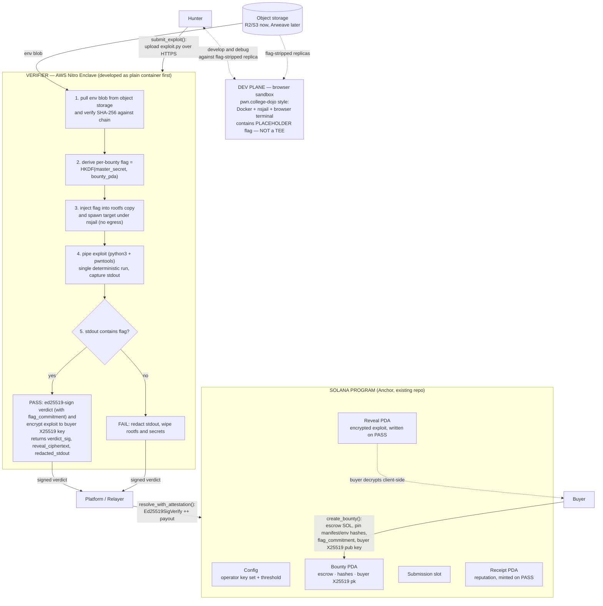

# SealedCodeBounty — Build Plan (R2, Handoff Document)

> **Purpose of this document:** a precise, self-contained specification of what to build, in what order, with which tools. It is written so that another engineer or AI agent can execute it without re-deriving any decisions. All open questions were settled in a design review on 2026-08-24; locked decisions are listed in §1 and must not be re-litigated.

---

## Revision log

- **R2 — post second external review (2026-08-24).** Adopted:
  **deterministic single-run verification for v1** (D13 — best-of-N re-runs moved to roadmap);
  **hardened on-chain signature check** — `resolve_with_attestation` now introspects the Ed25519
  instruction and binds the signed message + operator pubkeys, not just presence (§4.1);
  **`flag_commitment` bound into the verdict** (message bumped to `SCB_VERDICT_V2`, 129 bound
  bytes) so the committed flag is enforced end-to-end, not committed-but-unchecked (§4.1/§9);
  **KMS-from-enclave path corrected** — the enclave has no NIC, so master secret `M` is fetched via
  the parent's vsock proxy using `kmstool_enclave_cli` (§4.4); **`binary` manifest target kind added**
  alongside `tcp_service` so the parser/binary targets in D2 scope are packageable (§4.2/§4.3);
  **why-Nitro-over-Inco rationale recorded** (§2). Concurrency stays single-slot for v1 (honest
  note added to D5); anti-spam bond stays fully refundable (D10 unchanged — spam is not a v1 concern).
- **R1 — post external review (2026-08-24).** Adopted reviewer P0-1..P0-5 and P1-6..P1-10:
  solver-signed submission intent verified by the enclave (§4.3); client-side encrypt-to-enclave
  uploads with a chain-pinned enclave encryption key — the proxy/storage path never sees plaintext
  (§4.3/§4.4, supersedes the earlier "trusting the parent proxy" allowance); master secret `M`
  delivered via KMS policy conditioned on the attestation doc (§4.4); new permissionless
  `force_unlock_submission` instruction + post-deadline submit guard (§4.1, kills the
  relayer-censorship funds deadlock); refundable submission bond replaces free submissions (D10
  amended); dev plane reduced to local compose files (§4.5); CTF-challenge-first scope statement;
  full README rewrite moved into phase 0.

---

## 0. Architecture at a glance



**Two-plane rule (memorize this):** confidentiality only matters at *verification* time. Hunters develop against flag-stripped replicas in a normal Docker sandbox (dev plane). The real flag and the plaintext exploit only ever coexist inside the enclave (verification plane). Nothing in the dev plane needs a TEE.

---

## 1. Locked design decisions (do not revisit)

| # | Decision |
|---|---|
| D1 | **Product**: sealed exploit bounties. Buyer uploads a vulnerable environment; hunters upload exploits; success = exploit output contains a hidden flag; first verified PASS takes the whole pot; on PASS the buyer receives the exploit, on FAIL nobody ever sees it. |
| D2 | **Scope v1 = userspace targets only** (network services, binaries, parsers — pwn.college-style). Kernel-exploit tier (QEMU/KVM targets) is roadmap phase 9. |
| D3 | **Verification = flag-only.** No buyer-supplied checker code exists anywhere in the system. Platform-generated random flag injected inside the enclave. |
| D4 | **Payout trigger** = enclave's ed25519-signed verdict `{bounty_pda, exploit_sha256, solver_pubkey, flag_commitment, outcome}`, verified on-chain against keys pinned in a `Config` account. No private-key-as-prize. No ZK anywhere in v1. |
| D5 | **First verified PASS wins**, ordered by Solana slot (whichever valid verdict lands first). **v1 note:** because v1 serializes to a single in-flight submission slot (§4.1), this is in practice "first to *claim the slot* and pass"; true concurrent first-PASS-wins (per-solver `Submission` PDAs) is a roadmap upgrade (phase 9). |
| D6 | **TEE = AWS Nitro Enclave** for v1 (enough for userspace targets: container rootfs + nsjail inside the enclave; no nested virt needed). The on-chain interface is signature-only, so migrating later to Intel TDX / SEV-SNP confidential VMs (needed only for the kernel tier) changes pinned values, not program logic. |
| D7 | **Trust root v1**: platform authority transaction pins `(pcr0_hash, enclave_ed25519_pubkey)` pairs in `Config`, designed as a **key SET with threshold k-of-n** from day one (future staked-operator network plugs in without redesign). Honest limitation, documented: v1 users trust the platform operator. |
| D8 | **Storage**: Cloudflare R2 (or S3) bucket for env tarballs and oversized blobs in dev; migrate to Arweave for production. Only SHA-256 hashes + a manifest go on-chain. |
| D9 | **Reveal mechanism**: on PASS the enclave encrypts the exploit with the buyer's **X25519 public key** (registered in `create_bounty`) using a libsodium sealed box and writes the ciphertext into an on-chain `Reveal` PDA **inside the payout transaction**. Buyer decrypts client-side. Blobs > ~10 KB fall back to encrypted-object-on-R2 + hash on-chain. |
| D10 | **No revenue fees in v1**, but every submission posts a small **refundable bond** (lamports held in the Bounty PDA, returned automatically inside `resolve_with_attestation` regardless of outcome, and by `force_unlock_submission`). Spam costs capital-in-flight instead of being free; a revenue fee (global flat → treasury) and bond slashing both stay deferred. Old `SUBMISSION_FEE_LAMPORTS` semantics deleted. |
| D11 | **Failure feedback**: hunter receives their exploit's stdout/stderr with every occurrence of the flag string (plus its hex/base64 encodings) redacted. |
| D12 | **Solana's role beyond escrow** (build now, market always): verdict receipts as portable on-chain reputation; config designed for operator sets; agent-friendly API story. Deferred: staked operator slashing, escrow yield, disclosure-clock auto-publish, sealed-bid ranking. |
| D13 | **Deterministic verification (v1).** The enclave runs the exploit **exactly once**; `PASS` requires that single run's output to contain the flag. Exploits MUST therefore be deterministic — defeat ASLR within the exploit, avoid timing races. The manifest MAY request ASLR-off / fixed-seed in the target to aid reproducibility. **Best-of-N re-runs** (tolerating probabilistic exploits) are roadmap phase 9. Rationale: a single run keeps the verdict, redaction, and egress-invariant audit surface minimal; hunters can prove reliability locally against the placeholder replica (§4.5) before spending a submission. |

---

## 2. Current repository state and required cleanup

Repo: `/home/konstantine/Documents/work/sealed-code-bounty` (Anchor workspace, tests currently target devnet via ts-mocha).

Existing assets to KEEP:
- `programs/sealed-code-bounty/` — working escrow logic: `create_bounty.rs`, `submit_solution.rs`, `resolve_submission.rs` (manual, insecure-by-design — will be replaced), `cancel_expired_bounty.rs`; `state.rs`, `constants.rs`, `error.rs`, `events.rs`.
- `frontend/` — React + Vite + wallet-adapter skeleton (`useProgram.ts`, `pda.ts`, three forms).
- `tests/sealed-code-bounty.ts` — four integration tests proving money movement.

Cleanup steps (phase 0):
1. `git checkout -b v2` — do all v2 work on this branch.
2. Delete `programs/sealed-code-bounty-poc/` (the Inco Lightning proof-of-concept). Inco is fully out of the architecture (D6/D4). Keep it recoverable via git history. Removing it also removes the `anchor-lang 0.31.1` / `1.x` version split documented in `EXPLAIN.md`.
3. **Rewrite `README.md` for the pivoted architecture** (Nitro narrative, honest v1 trust-root section, updated mermaid) and tag `EXPLAIN.md` as pre-pivot history. No reader should meet two architectures in one repo (review P1-10). **Include a short "Why Nitro, not Inco Lightning" paragraph:** Inco Lightning provides *encrypted-data operations* (compute over ciphertext — e.g. `e_eq` over `Euint128`), not *arbitrary in-enclave code execution*. Real exploit verification means unpacking a rootfs, injecting a flag, and running `nsjail`-sandboxed target + attacker binaries — a full userspace Linux workload. A Nitro Enclave runs that directly; Inco cannot. The old "Why Inco" comparison in the pre-pivot README is history, not current guidance.
4. Switch the test suite default from devnet to a local validator (`anchor test` runs localnet by default; keep one optional devnet smoke test behind an env flag). Localnet = fast, deterministic, free; devnet is flaky for CI.

---

## 3. Component inventory (what gets built)

| Component | Tech | New/existing | Notes |
|---|---|---|---|
| Solana program v2 | Anchor (Rust) | evolve existing | §4.1 |
| Packager CLI | TypeScript (Node) or Rust | new | §4.2 |
| Verifier runner | Rust (axum + tokio) | new, core | §4.3 |
| TEE envelope | AWS Nitro Enclave (nitro-cli, EIF, NSM) | wrapper around runner | §4.4 |
| Relayer | TypeScript (Node) | new, tiny | §4.6 |
| Indexer + receipts API | TypeScript (Node) + SQLite/Postgres | new, small | §4.7 |
| Frontend v2 | existing React/Vite + wallet-adapter + libsodium | evolve | §4.8 |
| Dev plane sandbox | Docker Compose + nsjail + ttyd/code-server (patterns borrowed from `pwncollege/dojo`) | new, thin | §4.5 |

---

## 4. Component specifications

### 4.1 Solana program v2 (`programs/sealed-code-bounty/src/`)

Keep the module layout (`instructions/`, `state.rs`, `errors.rs`, `events.rs`, `constants.rs`). Evolve in place.

#### Accounts

**`Config`** (PDA seed `["config"]`, singleton):
- `platform_authority: Pubkey`
- `operators: Vec<Pubkey>` — enclave signing keys (start with n=1)
- `threshold: u8` — required matching signatures (start with 1)
- `enclave_enc_pk: [u8; 32]` — enclave's **X25519 encryption key** (set alongside operators; hunters seal exploit uploads to it client-side — review P0-1/P1-7)
- `submission_bond_lamports: u64` — refundable anti-spam bond per submission (D10 as amended)
- `bump`
Created by `initialize_config(platform_authority)`. Updated by `set_operators(operators, threshold)` — authority-only. **Design for the set now even though n=1 at launch (D7).**

**`Bounty` v2** (PDA seed `["bounty", buyer, bounty_id]` — keep existing seed scheme):
- `buyer: Pubkey`, `bounty_id: u64`
- `status: BountyStatus` — enum `{Open, AwaitingResolution, Resolved, Cancelled}` (replace the current `submitted/resolved` booleans)
- `prize_lamports: u64`, `deadline: i64`
- `manifest_sha256: [u8; 32]` — hash of the manifest JSON (§4.2)
- `env_blob_sha256: [u8; 32]` — hash of the environment tarball
- `flag_commitment: [u8; 32]` — `sha256(flag)` produced by the enclave sealing step. **As of R2 this is enforced end-to-end:** the verdict carries `flag_commitment` and `resolve_with_attestation` asserts it equals this field (see verdict message + verification below).
- `buyer_enc_pk: [u8; 32]` — buyer's X25519 public key
- `current_submission: Option<SubmissionRef>` — `{solver: Pubkey, exploit_sha256: [u8;32], blob_url: String≤200, bond_lamports: u64, submitted_at: i64}` (single-slot serialization keeps first-PASS-wins trivial; retry allowed only after FAIL/unlock resolution — see D5 v1 note)
- `winner: Option<Pubkey>`
Escrow stays as today: prize transferred into the PDA at creation; rent swept on close.

**`Receipt`** (PDA seed `["receipt", bounty, winner]`, created only on PASS — the reputation primitive, D12):
- `bounty: Pubkey`, `solver: Pubkey`, `exploit_sha256: [u8; 32]`, `first_blood: bool`, `timestamp: i64`

**`Reveal`** (PDA seed `["reveal", bounty]`, created only on PASS):
- `ciphertext: Vec<u8>` ≤ 10_240 bytes (libsodium sealed box over the exploit script)
- If the sealed box exceeds the cap, store `ciphertext_url: String≤200` + `ciphertext_sha256` instead (object on R2 encrypted the same way).

#### Instructions

| Instruction | Who | Signature/args | Validation highlights |
|---|---|---|---|
| `initialize_config` | deployer | `(platform_authority)` | once |
| `set_operators` | authority | `(operators: Vec<Pubkey>, threshold: u8)` | `threshold ≥ 1 && threshold ≤ len` |
| `create_bounty` | buyer | `(bounty_id, prize, deadline, manifest_sha256, env_blob_sha256, flag_commitment, buyer_enc_pk)` | nonzero prize; future deadline; escrow transfer into PDA (reuse existing handler body) |
| `submit_exploit` | hunter | `(blob_url ≤200 chars, exploit_sha256)` | status Open; `current_submission.is_none()`; **`Clock::get() < deadline`** (submissions after expiry must revert); transfers `submission_bond_lamports` from hunter into the PDA (recorded in `SubmissionRef.bond_lamports`, refunded on any resolution); sets `AwaitingResolution` |
| `resolve_with_attestation` | relayer (permissionless) | `(outcome: bool, sig_count, signatures: Vec<[u8;64]>)` + accounts incl. the **Ed25519 native program** and the **Instructions sysvar** | see verification pattern below; PASS ⇒ pay winner + create `Receipt` + create `Reveal` + status Resolved; FAIL ⇒ wipe `current_submission`, status back to Open; bond refunded either way |
| `cancel_expired_bounty` | buyer | unchanged | keep existing semantics: requires expired AND no pending submission |
| `force_unlock_submission` | **anyone (permissionless)** | accounts only | anti-censorship escape hatch (review P0-4): callable while `status == AwaitingResolution` and `submitted_at + FORCE_UNLOCK_DELAY_S < Clock::get()` (const, e.g. 3600 s); refunds the bond, wipes `current_submission`, returns status to `Open`. A hostile/silent relayer can therefore only *delay* a bounty, never lock its prize. |

**Verdict message (canonical bytes, signed by enclave) — `SCB_VERDICT_V2`:**

```
msg = b"SCB_VERDICT_V2"        (14 B domain tag)
    || bounty_pda              (32 B)
    || exploit_sha256          (32 B)
    || solver_pubkey           (32 B)
    || flag_commitment         (32 B)   <-- new in R2; = sha256(flag) used this run
    || outcome                 (1 B, 0x00=FAIL 0x01=PASS)
```
**129 bytes of bound fields** (143 B on the wire including the 14-byte domain tag). The `V2` tag both provides domain separation against cross-protocol replay and distinguishes this format from the R1 `V1` message. Binding `flag_commitment` closes the old "committed-but-not-checked" gap: the on-chain program verifies the verdict was produced against the exact flag the bounty committed to.

**Solver authentication (review P0-2):** the enclave never learns the solver from the relayer. Before executing anything it verifies a **submission-intent signature**: `solver_ed25519_sign(b"SCB_SUBMIT_V1" || bounty_pda || exploit_sha256)` against the claimed `solver_pubkey` (see §4.3 handshake). A hostile relayer naming its own wallet cannot pass this check, so the verdict's `solver_pubkey` is cryptographically bound to whoever possessed the plaintext. The intent signature is echoed into the `Receipt`/`Reveal` event data for post-hoc dispute audits. The enclave signs exactly the `SCB_VERDICT_V2` bytes with its pinned ed25519 key.

**Signature verification pattern (critical implementation detail — presence is NOT enough):**
Use Solana's native **Ed25519 program** (`Ed25519SigVerify1111111111111111111111111111`) rather than doing curve math in the Anchor program. The relayer places one `Ed25519SigVerify` instruction (or `k` of them for threshold) *before* `resolve_with_attestation` in the same atomic tx. Inside `resolve_with_attestation` you MUST, via the **Instructions sysvar** (`sysvar::instructions::load_instruction_at_checked`), do all of the following — not merely assert that an Ed25519 instruction exists:
1. **Recompute** the expected 143-byte `SCB_VERDICT_V2` message from the handler's own accounts/args: `bounty.key()`, `current_submission.exploit_sha256`, `current_submission.solver`, `bounty.flag_commitment`, and the `outcome` arg. Never trust a message handed in by the relayer.
2. **Parse each preceding Ed25519 instruction's data** (the native program's layout: `num_signatures`, then per-signature `sig_offset/pubkey_offset/msg_offset/msg_size` and the embedded pubkey/sig/message bytes) and assert its **message bytes byte-for-byte equal** the recomputed message, and its **`msg_size == 143`**.
3. Assert each signing **pubkey ∈ `Config.operators`**, and that you collected **`threshold` distinct operator pubkeys** (reject duplicates padding to threshold).
4. Assert the verdict's `exploit_sha256` equals `current_submission.exploit_sha256` (else `SubmissionMismatch`) and `flag_commitment` equals `bounty.flag_commitment`.

Atomicity then guarantees the signatures were checked by the native program over exactly the bytes you bound. A relayer supplying a valid signature over a *different* message, a non-operator key, or a mismatched flag/exploit is rejected.

- Keep the whole thing within the 1232-byte tx limit: 143-byte msg + 64-byte sig(s) + accounts fits comfortably for k ≤ 3. Recount bytes whenever k grows.

**Events** (update `events.rs`): `BountyCreated`, `ExploitSubmitted`, `BountyResolved(outcome, winner)`, `BountyCancelled`, plus `OperatorSetChanged`.

**Errors**: reuse existing variants; add `InvalidOutcome`, `NotAwaitingResolution`, `SubmissionMismatch` (verdict's `exploit_sha256` ≠ `current_submission.exploit_sha256`), `FlagCommitmentMismatch` (verdict's `flag_commitment` ≠ `bounty.flag_commitment`), `MissingSigVerify` (no matching Ed25519 instruction / wrong message), `UnauthorizedOperator`, `BadThreshold`.

**Tests to add/modify** (`tests/sealed-code-bounty.ts`): happy-path PASS pays winner + creates Receipt + Reveal; FAIL discards and allows resubmit; bond refunded on PASS/FAIL/unlock; second `resolve_with_attestation(PASS)` after Resolved rejects; verdict with wrong `exploit_sha256` rejects; verdict with wrong `flag_commitment` rejects; verdict signed by a non-operator key rejects; tx missing the Ed25519 verify instruction rejects; tx whose Ed25519 message differs from the recomputed bytes rejects (raw-txn tests); expired-cancel rules unchanged; `force_unlock_submission` restores Open + refund after delay, double-unlock reverts. Run against localnet.

### 4.2 Manifest + environment packaging

**Manifest JSON (committed by hash on-chain at `create_bounty`)**:

```json
{
  "format_version": 2,
  "name": "heap-overflow-noteservice",
  "image_tarball": { "url": "https://<bucket>/envs/<sha256>.tar.gz", "sha256": "<hex>" },
  "target": { "kind": "tcp_service", "host": "127.0.0.1", "port": 1337 },
  "limits": { "timeout_seconds": 60, "memory_mb": 512, "cpus": 1 },
  "determinism": { "aslr": "off", "seed": 0 },
  "flag_placeholder": "{{FLAG}}",
  "entrypoint": "/sbin/init-or-service-start-script"
}
```

**Target kinds** (`target.kind`, covering the D2 v1 scope — network services, binaries, parsers):
- `"tcp_service"` — `{ kind, host, port }`. Runner starts the entrypoint service; the exploit connects over loopback (e.g. `target:1337`).
- `"binary"` — `{ kind, exec, io: "stdio", argv?: [..] }`. Runner spawns `exec` under nsjail with the exploit driving it over **stdin/stdout** (no listening socket). This covers local pwn binaries and parsers that read a file/stream: for a parser, `argv` may reference an input path the exploit writes into `/work`.

Rules:
- The environment tarball is a **Docker `save`d image** (or a plain rootfs tarball — pick Docker-save; it preserves everything needed and the packager builds it from a Dockerfile anyway).
- Inside the image, the flag file `/flag` contains exactly the literal string `{{FLAG}}` (the placeholder, D3). The packager enforces this and refuses images where `/flag` is missing or lacks the placeholder.
- `determinism` block (D13): the packager should honor `aslr: "off"` (e.g. bake `echo 0 > /proc/sys/kernel/randomize_va_space` into the entrypoint, or set the personality flag when spawning) so a correct exploit reproduces deterministically in the single verification run. Optional `seed` pins any RNG the target exposes.
- Same artifact serves both planes: dev plane runs it as-is (placeholder visible = harmless), verification plane swaps the placeholder for the derived real flag inside the enclave.

**Packager CLI** (`cli/` in repo): `scb-pack ./Dockerfile-dir --out manifest.json`
Steps: docker build → assert `/flag` contains placeholder → `docker save` → gzip → sha256 → upload to R2 (presigned URL or scoped credentials) → emit `manifest.json`. Reference for conventions: `pwncollege/dojo` challenge format (`docs/challenge.md` in that repo) and `google/kctf` challenge templates.

### 4.3 Verifier runner (core new software — build as a plain container FIRST)

Language: **Rust** (axum + tokio). Rationale: this component *is* the trust of the product (verdict-bit-only egress, D3/D4); a small, auditable, memory-safe binary beats dev speed here. It must compile unchanged inside a Nitro EIF later.

HTTP API (bound to vsock/localhost only — never exposed publicly except through the parent proxy):

| Endpoint | Purpose |
|---|---|
| `POST /internal/seal_bounty {bounty_pda}` | F1 below; returns `{flag_commitment}` |
| `POST /internal/verify {bounty_pda, claimed_chain_view, solver_pubkey, submit_intent_sig, exploit_sealed_box ≤256KB}` | authenticates the solver, unseals the payload, runs the full pipeline; returns verdict + artifacts |
| `GET /internal/healthz` | liveness |

**Upload handshake (integration contract — closes both the plaintext-at-proxy and metadata-spoofing seams):**
1. Hunter's client fetches `Bounty` state via **its own RPC** (env hash, buyer pk, deadline).
2. Client seals the exploit: `crypto_box_seal(exploit.py, Config.enclave_enc_pk)` — every intermediary (proxy, bucket, logs) sees only ciphertext (review P0-1/P1-7).
3. Client signs the intent `SCB_SUBMIT_V1 || bounty_pda || sha256(exploit_plaintext)` with the solver wallet and POSTS `{bounty_pda, claimed_chain_view, solver_pubkey, submit_intent_sig, exploit_sealed_box}`.
4. Enclave, in order: verify `submit_intent_sig` against `solver_pubkey` (abort on failure — before any expensive work); open the sealed box; compare `claimed_chain_view.{env_blob_sha256, buyer_enc_pk}` against the relayer-supplied view and **abort on divergence** (never guess which is right — full account-data proofs are the phase-9 fix); recompute `sha256` of the unsealed plaintext.
5. Enclave persists the blob + metadata and returns a receipt hash.
6. Only then does the hunter call `submit_exploit(exploit_sha256)` on-chain; the relayer dispatches jobs **only after** confirming enclave-side blob presence — eliminating the bogus-FAIL ordering race.

Pipeline inside `POST /internal/verify` (all steps in order; any failure ⇒ verdict FAIL with reason):
1. Download `env_blob` from object storage; **check `sha256 == bounty.env_blob_sha256`** (fetched from chain by relayer and passed in, or read from a chain-view cache — the hash comparison itself MUST happen inside the enclave).
2. Unpack rootfs safely: enforce max uncompressed size (e.g. 2 GB), reject path traversal/symlinks escaping rootfs, cap file count (zip-bomb defense).
3. **Flag derivation (F1/F2)**: master secret `M` (32 B, see §4.4 key ceremony). `flag = base58(HKDF-SHA256(ikm=M, salt=bounty_pda, info=b"scb-flag-v1", L=32))`. Deterministic per bounty — no flag storage needed anywhere. `POST /internal/seal_bounty` computes `flag_commitment = sha256(flag)` at bounty-creation time; the buyer's create-flow calls it and puts the commitment on-chain. **Blast radius (review P0-3):** a leak of master secret `M` compromises every flag, past and future — hence KMS-conditioned delivery in §4.4 step 4 is mandatory in v1, not roadmap.
4. Replace the placeholder string `{{FLAG}}` in `/flag` (and only there) inside the rootfs copy with the derived flag.
5. Spawn target under **nsjail** from the rootfs: own mount/PID/IPC namespaces, `--time_limit` from manifest, RLIMIT_AS per manifest, **network namespace with no external route** (loopback only). Apply the manifest `determinism` block (D13: disable ASLR in the target namespace if requested). Start the service entrypoint (`tcp_service`) or prepare the binary (`binary`).
6. Spawn the exploit in a second nsjail profile sharing the SAME network namespace as the target (so it can reach `target:1337` via loopback) but with cwd=`/work`: `python3 exploit.py` — the runtime image ships **python3 + pwntools** preinstalled. For a `binary` target the exploit drives the target over stdio instead of a socket. Capture combined stdout+stderr with a hard wall-clock cap.
   - v1 simplification: target + exploit share one netns; the runner itself is outside that netns and reachable only via inherited stdio FDs. Hardening roadmap: separate netnses joined by an internal veth pair.
7. **Single deterministic run (D13).** Run the exploit **exactly once**. `PASS = stdout.contains(flag)` (plain substring match) on that one run — no retries, no best-of-N in v1. Non-deterministic exploits are the hunter's responsibility; they can validate reliability locally against the placeholder replica (§4.5) before submitting. Redact every occurrence of the flag string and its hex/base64 encodings → `[REDACTED]` (D11). Persist redacted log for hunter feedback.
8. Sign the 143-byte canonical `SCB_VERDICT_V2` message (§4.1), including `flag_commitment = sha256(flag)` for this bounty, with the enclave's ed25519 key.
9. If PASS: `sealed = crypto_box seal(exploit_py, buyer_x25519_pk)` (libsodium sealed box; use the Rust `crypto_box` crate). Return `{outcome, sig, reveal_ciphertext, redacted_log}`.
10. Zeroize flag material; drop the rootfs copy; nothing about a FAILED attempt persists beyond the redacted log (D3).

Relayer-facing behavior: the relayer (parent side) polls the chain for `ExploitSubmitted` events, streams the job to the enclave, then composes the tx: `[Ed25519SigVerify(msg,sig)] ++ resolve_with_attestation(...)`.

### 4.4 TEE envelope (AWS Nitro Enclave) — LAST integration step, not first

Why safe to defer (D6): the runner is a plain container until this phase; the chain only sees signatures.

Setup:
1. Parent instance: `c6i.2xlarge` (or larger, `.metal` for `nitro-cli`), Amazon Linux 2023, install `nitro-cli`, `aws-nitro-enclaves-sdk`, allocate vCPU/mem in `/etc/nitro_enclaves/allocator.yaml`.
2. Build EIF: `nitro-cli build-enclave --docker-uri <runner-image> --output-file runner.eif`. `PCR0` = measurement of this exact image (this is what gets pinned, D7).
3. Key ceremony (first boot, inside enclave):
   - Enclave generates ed25519 keypair via the **NSM device**: `NSM_GetAttestationDoc` with the public key in the doc's `public_key` field → returns the signed **attestation document** containing PCR0..2 + that pubkey. Rust helper crate: `aws-nitro-enclaves-nsm-api`.
   - Operator verifies the attestation document **off-chain** (v1, D7) using AWS's root cert bundle + the `aws-nitro-enclaves-attestation` tooling/lib, checks `PCR0 == expected`, extracts the pubkey, then calls `set_operators([pubkey], 1)`.
   - Roadmap (documented, not built): full on-chain verification of the COSE/CBOR attestation chain to the AWS root.
4. **Master secret `M` delivery (mandatory in v1, review P0-3) — corrected in R2.** `M` lives inside an AWS KMS key whose **policy grants Decrypt only to requests presenting a valid attestation document carrying the pinned PCR0** (official Nitro↔KMS pattern). **The enclave has no NIC**, so it cannot call KMS directly: it issues the `kms:Decrypt` through the parent over **vsock** using **`kmstool_enclave_cli`** (from `aws-nitro-enclaves-sdk-c`), which attaches the enclave's attestation document to the request; the parent-side `kmstool_instance`/vsock-proxy forwards it to the regional KMS endpoint. KMS returns the plaintext `M` **encrypted to the enclave's attested public key**, so the parent relays ciphertext only and `M` never exists in plaintext outside the enclave. The enclave fetches `M` at boot via this path.
5. Networking: enclave has no NIC. Parent runs `vsock-proxy` + socat/nginx bridging TCP :443 → vsock CID/port to the runner (and the KMS vsock-proxy from step 4). **TLS terminates inside the enclave in v1** (self-signed cert hash in the attestation doc's `user_data`); combined with client-side sealing (§4.3 handshake) the proxy relays ciphertext only. The earlier "trust the parent proxy" allowance is withdrawn (review P0-1).
6. Cost reality: `nitro-cli` requires a `.metal` instance; metal instances don't do spot. Budget a handful of dollars: reserve on-demand bursts of ~1 hour ($3–5) for build/test cycles, terminate immediately. Alternative while iterating: GCP $300 trial on a C3/TDX confidential VM exercises the identical signature interface (only §4.4 differs, not §4.1–4.3; GCP Confidential Spaces are a credible demo alternative — attestation-to-KMS is first-class there and the $300 trial covers it).

### 4.5 Dev plane (hunter's workshop) — LOCAL ONLY in v1

Per review P1-9: hosting anonymous buyers' Docker images on platform VMs creates malware liability and contradicts permissionless operation. v1 ships **zero hosted sandboxes**:

- `scb-pack` emits, next to the manifest, a ready-to-run `docker-compose.yml`: `target` service (the packed image with placeholder `/flag`) + `workspace` service (ubuntu + tmux + python3 + pwntools + ttyd browser terminal at localhost:7681).
- Hunters run replicas on their own machines (`docker compose up`), develop freely, and capture the placeholder flag locally to prove an exploit works **deterministically** before spending a submission (D13 — the single verification run must reproduce what they saw locally).
- A hosted multi-tenant dev plane returns post-MVP, gated on sandbox hardening + ToS + an honest answer to the review question.

### 4.6 Relayer

Tiny Node/TypeScript service on the parent VM:
- Subscribes to program events (`program.addEventListener`).
- On `ExploitSubmitted`: fetch Bounty + Submission data, call enclave `/internal/verify`, receive verdict.
- Builds and sends the tx: `[Ed25519SigVerify] ++ resolve_with_attestation(...)`, signed by a platform-funded keypair (fees only; funds movement is governed by the program, not the relayer — permissionless: anyone may run a relayer).
- Retry/backoff on enclave timeouts (timeout ⇒ submit FAIL verdict so the bounty unlocks).

### 4.7 Indexer + receipts (reputation, D12)

- Small TS service consuming events into SQLite (upgrade Postgres later); exposes REST: `GET /bounties`, `GET /hunters/:pubkey/receipts`, leaderboard.
- On-chain `Receipt` PDAs remain the source of truth; the indexer is a convenience view.
- This powers the public leaderboard page — cheapest high-impact feature for the "on-chain exploit track record" narrative.

### 4.8 Frontend v2 (existing React/Vite app)

Buyer flow:
1. Connect wallet → generate X25519 keypair with `libsodium-wrappers`; show the private key once with "download backup" (derive non-custodially; losing it loses access to reveals).
2. Create-bounty form: packager output (paste/upload `manifest.json`), prize (SOL), deadline → `create_bounty` (+ call enclave `/internal/seal_bounty` first to obtain `flag_commitment`).
3. Bounty dashboard: submissions, PASS/FAIL states; on PASS fetch `Reveal` PDA, decrypt sealed box client-side, display/download exploit.

Hunter flow:
1. Browse bounties (from indexer); download dev-plane compose files.
2. Submit exploit: paste or upload `exploit.py` → HTTPS upload to enclave (via parent proxy) → wait for verdict → on FAIL show redacted log; on PASS celebrate receipt.
3. Profile page: receipts/leaderboard from indexer.

IDL sync: after each `anchor build`, refresh `frontend/src/idl/*` from `target/idl` + `target/types` (existing workflow documented in `EXPLAIN.md`).

---

## 5. Build order (phases with acceptance criteria)

| Phase | Deliverable | Done when |
|---|---|---|
| 0. Cleanup | branch `v2`; Inco POC removed; localnet-first tests; README rewritten (incl. "why Nitro not Inco") | `anchor test` green on localnet |
| 1. Program v2 | Config/Bounty-v2/Receipt/Reveal accounts + 7 instructions (incl. `force_unlock_submission`) + events/errors + tests | all §4.1 scenarios pass on localnet: ed25519-verdict happy path (message + operator-key + flag_commitment binding), rejection paths (wrong exploit_sha256, wrong flag_commitment, non-operator key, missing/mismatched SigVerify), post-deadline submit rejected, bond refunded on PASS/FAIL/unlock |
| 2. Packaging | `scb-pack` CLI + manifest schema (v2, both target kinds) + R2 bucket + one sample challenge (e.g. trivial stack-overflow echo service) | running `scb-pack` produces a manifest whose blob hash matches what's on-chain; a `binary`-kind sample also packages |
| 3. Runner (plain container) | full §4.3 pipeline, unsigned verdicts logged to stdout | end-to-end on laptop: correct `exploit.py` prints PASS on a **single deterministic run**; wrong exploit prints FAIL; redaction proven; timeout proven; **sealed-upload + solver-intent-signature path proven (bad intent sig refused)** |
| 4. Wire runner ↔ program | relayer + real signature + `resolve_with_attestation` | localnet end-to-end: submit → verdict lands → escrow moves to solver → Receipt + Reveal PDAs exist; flag_commitment binding verified on-chain |
| 5. Dev plane (local) | packager emits per-bounty `docker-compose.yml` | hunter runs the placeholder-flag replica locally and captures it manually |
| 6. Frontend v2 | buyer + hunter flows live against devnet/localnet | full UI walkthrough with two wallets (Phantom) completes a paid PASS |
| 7. Nitro envelope | §4.4 steps 1–5 on AWS (incl. `kmstool_enclave_cli` vsock path) | attestation doc verified off-chain; `M` fetched via vsock KMS; pinned key resolves a real bounty on devnet from inside the enclave |
| 8. Indexer + leaderboard | §4.7 service + UI page | receipts visible; leaderboard ranks the demo wallets |
| 9. (Roadmap) | best-of-N probabilistic verification; kernel-tier via TDX/SEV-SNP CVMs; per-solver concurrent submissions (true first-PASS-wins); staked operator network (threshold >1 + slashing); bond slashing / fees; Arweave; disclosure clock; full on-chain attestation verification | out of scope until 1–8 are shipped |

Recommended cadence (solo + AI assistance): phases 0–1 ≈ week 1–2, 2–3 ≈ week 2–4, 4 ≈ week 4–5, 5–6 ≈ week 5–7, 7 ≈ week 7–8, 8 ≈ week 8.

---

## 6. Exact tools & dependencies

**Chain**: Rust stable (keep `rust-toolchain.toml`), Solana CLI, Anchor (existing version), `@anchor-lang/core` (TS client, already in package.json). Local validator for tests; `solana airdrop` only for the optional devnet smoke test.

**Program crates**: `anchor-lang` (existing); no new deps needed for ed25519 (native program + Instructions sysvar introspection). Optional: `getrandom` for ids.

**Runner (Rust)**: `axum`, `tokio`, `serde`/`serde_json`, `sha2`, `hkdf`, `rand`, `bs58`, `ed25519-dalek`, `crypto_box` (libsodium-compatible sealed boxes), `flate2` + `tar` (unpacking), `aws-nitro-enclaves-nsm-api` (phase 7 only), `anyhow`/`thiserror`.

**Execution sandbox inside runner**: `nsjail` (static binary baked into the runner image), `python3`, `pwntools` (pip, preinstalled in the exploit runtime), `iptables`/iproute for netns isolation, `cgroup-tools` or systemd-run for memory/CPU caps.

**Relayer/indexer/CLI (Node ≥20)**: `typescript`, `@anchor-lang/core`, `ws`, `fastify` (indexer REST), `better-sqlite3`, `aws4fetch` or `@aws-sdk/client-s3` (R2 is S3-API-compatible), `commander` (CLI), `libsodium-wrappers` (also in frontend).

**Frontend (existing)**: add `libsodium-wrappers`, `@noble/hashes` if needed; keep Vite + wallet-adapter as-is.

**TEE**: `nitro-cli`, `aws-nitro-enclaves-cli` + allocator, `aws-nitro-enclaves-sdk-c` (provides `kmstool_enclave_cli`), `vsock-proxy` + `socat`/nginx on parent, AWS cert bundle for offline attestation-doc verification.

**Infra (dev)**: one Cloudflare R2 bucket (free tier suffices), one small VM (any $5 box) hosting dev-plane compose + later the Nitro parent, GitHub Actions for `anchor build` + localnet tests on PR.

---

## 7. Open-source projects to borrow from (with licenses)

| Repo | License | Take |
|---|---|---|
| `pwncollege/dojo` | BSD-2-Clause (commercial OK, keep notice) | workspace/browser-terminal containers, per-user orchestration patterns, challenge container conventions (`docs/challenge.md`), nsjail usage. Strip education layer. |
| `google/security-research` → `kernelctf/server` | Apache-2.0 | `server.py`: provisioning isolated target instances per session, slot management, flag-theft verification flow. The closest existing implementation of your verification concept. |
| `google/kctf` | Apache-2.0 | remote-challenge templates: nsjail wrapping, flag mounting, xinetd-style service exposure — the "company uploads a problem" packaging reference. |
| `CTFd/CTFd` | check current license (historically permissive w/ branding clauses) | only as inspiration for bounty-listing UX; dojo already embeds a CTFd fork. |
| `zkPoEx` (`ziemen4/zkpoex`) | MIT/GPL mix (check per-crate) | conceptual reference only (ZK route is parked, D4); its docs articulate the threat model nicely for your README. |
| `trailofbits` — general | — | read their "proof of exploitability" writings for pitch language, not code. |

Rule of thumb: **never paste code without checking the license header of the exact file**, and record provenance in `THIRD_PARTY_NOTICES.md`.

---

## 8. Security hardening checklist (before real money)

- [ ] Verdict-bit egress invariant: audit the runner for any code path that could persist or transmit exploit bytes on FAIL (D3). The runner image should have no outbound network capability at all except the responses it returns.
- [ ] Hash checks inside the enclave (never trust parent-forwarded metadata for the allow-decision).
- [ ] Verdict binding on-chain: `resolve_with_attestation` recomputes the message and checks message-bytes + operator-key + `flag_commitment` + `exploit_sha256` (never trusts a relayer-supplied message; presence of an Ed25519 instruction is insufficient).
- [ ] Unpacking defenses: size caps, symlink/traversal rejection, file-count caps (zip bombs).
- [ ] nsjail profiles reviewed: no capabilities, no devices, readonly rootfs for target, tmpfs workdir for exploit, hard wall-clock kill.
- [ ] Netns isolation: target+exploit share loopback only; no default route; runner unreachable from inside (v1) — schedule veth-split hardening.
- [ ] Abuse controls: CPU/mem caps per run (crypto-mining in uploaded envs); per-buyer upload quota and platform review queue for first uploads from new buyers (you are hosting third-party binaries — a ToS/legal matter too). (Hunter-side spam is explicitly deferred — D10 bond stays fully refundable in v1.)
- [ ] Relayer is permissionless and non-trusted by construction — test that a hostile relayer cannot change outcomes (only replay/omit).
- [ ] Key rotation story: `set_operators` exists from day 1 even if unused; document compromise procedure.
- [ ] Buyer key-loss UX warning (X25519 private key backup) in the UI.
- [ ] **Invariant: no component outside the enclave ever observes exploit plaintext** — audit proxies/loggers/bucket paths during review (review P0-1/P1-7).
- [ ] Negative tests: wrong intent signer refused; chain-view mismatch aborts (never guesses); submit-after-deadline reverts; wrong `flag_commitment`/`exploit_sha256` verdict rejected; non-operator signature rejected; `force_unlock_submission` restores Open + refund; double-unlock reverts.
- [ ] Bond accounting: PDA lamport ledger reconciles across PASS / FAIL / unlock paths (no dust locks).
- [ ] Honest trust-root disclosure in README (v1 pins platform-operated enclave; roadmap decentralizes).

---

## 9. Known simplifications (declared, deliberate)

1. Platform-pinned enclave key = trust the operator (D7). Decentralization roadmap exists.
2. Single-netns sandbox sharing (runner outside netns). Hardening: split netns + internal veth.
3. **Deterministic single-run verification (D13).** v1 runs the exploit once; probabilistic/flaky exploits can FAIL. Best-of-N re-runs are roadmap phase 9.
4. Chain-view cross-check instead of full account-data proofs (enclave aborts on divergence rather than proving which view is canonical).
5. Off-chain attestation-doc verification instead of full on-chain AWS-root chain validation.
6. Single submission slot → D5 is "first to claim the slot and pass"; true concurrent first-PASS-wins (per-solver `Submission` PDAs) is roadmap.
7. No fees and a fully-refundable (non-slashing) bond (D10); no SPL-token prizes (SOL-only v1); serial retries.
8. R2 instead of Arweave (D8); local-only dev plane.

Resolved since R1: master secret is now KMS-conditioned (§4.4 step 4, no longer a simplification); `flag_commitment` is now bound into the verdict and checked on-chain (no longer committed-but-unchecked).

Each remaining item maps to a roadmap entry in §5 phase 9 or §4.4/§8 notes — nothing here silently weakens the core guarantee (failed exploits stay sealed; payouts follow verified verdicts).

---

## 10. Practical advice / pitfalls

- **Do not start with the TEE.** Everything through phase 4 runs on a laptop container. TEE work is envelope, not substance; teams that start there stall.
- **Localnet first, devnet for demos only.** Your current devnet ts-mocha suite is slow/flaky; flip default to localnet (phase 0) and keep CI green.
- **Bind the verdict, don't just check presence.** The single most important on-chain footgun: asserting "an Ed25519SigVerify instruction ran" is NOT enough — you must recompute the 143-byte message and compare the native instruction's embedded message bytes + pubkeys (§4.1). A test that omits this binding and still passes payout is a red flag.
- **Determinism (D13).** Verification is a single run. Bake ASLR-off / fixed seeds into the manifest `determinism` block for reproducibility, and tell hunters to prove reliability on the local replica first. If you later need probabilistic exploits, that's the phase-9 best-of-N upgrade, not a v1 hack.
- **Tx size discipline**: verdict message (143 B) + sig (64 B) + accounts fits easily, but the moment you add multiple signatures (k>1) recount bytes against the 1232-byte limit.
- **Anchor `InitSpace` sizing**: `Reveal.ciphertext` up to 10 KB dominates account rent — compute rent-exempt minimums in the UI so buyers aren't surprised; consider making the payer the solver on PASS (they benefit from the receipt).
- **Clock skew**: `deadline` comparisons use `Clock::get()`; tests must warp time via the validator (your existing expiry test already does this pattern).
- **pwntools startup cost** (~1–2 s import) counts against the exploit timeout — bake it into `timeout_seconds` guidance in the manifest docs.
- **KMS from the enclave**: don't try to give the enclave a NIC — use `kmstool_enclave_cli` over vsock (§4.4 step 4). This trips up first-time Nitro builders.
- **Never log the flag.** Grep the runner codebase for the flag variable in logging macros during review; make the compiler help by keeping the flag in a newtype with no `Display`.
- **Demo script** (for hackathons/grants): pre-seeded sample bounty → hunter develops in browser terminal → submits wrong exploit (show FAIL + redacted log + no leak) → submits correct exploit → watch escrow pay + receipt mint → buyer decrypts reveal live. Rehearse on localnet with a fallback recording.
- **Free-tier reality**: GCP $300 trial or Azure $200 credit covers TDX/confidential-VM experiments; Nitro needs brief on-demand `.metal` bursts (~$3–5/hr, no spot). Either way the chain-side code is identical (D6).

---

*End of document*
